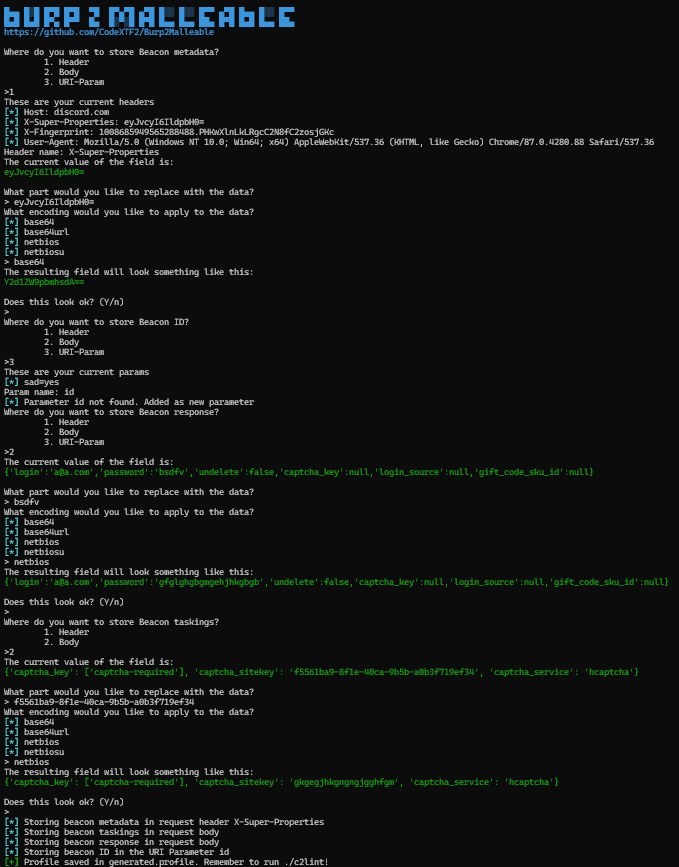

# Burp2Malleable

Quick python utility I wrote to turn HTTP requests from burp suite into Cobalt Strike Malleable C2 profiles.    
It lets you take captured/crafted requests from BurpSuite (or ZAP, POSTMAN etc.) of what you want your traffic to look like/blend in with, and turns them into CobaltStrike Malleable C2 profiles. It allows the operator to choose where their data is stored and in what format, so that the traffic looks as clean as possible.

#### Feel free to create issues for feature requests or bugs etc!

## Installation
```
pip install -r requirements.txt
```
## Usage
```
python burp2malleable.py request.txt response.txt
```

  
### Example request and response
```
POST /api/v9/auth/login HTTP/1.1
Host: discord.com
X-Super-Properties: eyJvcyI6IldpbH0=
X-Fingerprint: 1008685949565288488.PHKwXlnLkLRgcC2N8fC2zosjGKc
User-Agent: Mozilla/5.0 (Windows NT 10.0; Win64; x64) AppleWebKit/537.36 (KHTML, like Gecko) Chrome/87.0.4280.88 Safari/537.36

{"login":"a@a.com","password":"bsdfv","undelete":false,"captcha_key":null,"login_source":null,"gift_code_sku_id":null}


HTTP/1.1 400 Bad Request
Date: Mon, 15 Aug 2022 10:38:13 GMT
Content-Type: application/json
Content-Length: 127
Connection: close
access-control-allow-origin: https://discord.com
access-control-allow-credentials: true
access-control-allow-methods: POST, GET, PUT, PATCH, DELETE
access-control-allow-headers: Content-Type, Authorization, X-Audit-Log-Reason, X-Track, X-Super-Properties, X-Context-Properties, X-Failed-Requests, X-Fingerprint, X-RPC-Proxy, X-Discord-Locale, X-Debug-Options, x-client-trace-id, If-None-Match, Range, X-RateLimit-Precision
strict-transport-security: max-age=31536000; includeSubDomains; preload
x-envoy-upstream-service-time: 40
Via: 1.1 google
Alt-Svc: h3=":443"; ma=86400, h3-29=":443"; ma=86400
CF-Cache-Status: DYNAMIC
Expect-CT: max-age=604800, report-uri="https://report-uri.cloudflare.com/cdn-cgi/beacon/expect-ct"
Report-To: {"endpoints":[{"url":"https:\/\/a.nel.cloudflare.com\/report\/v3?s=NVkTuc0Tiecsv86A00v9WwDmAGBhWkOIUSbzNAmn7bbAEuwnrV8j1%2BNMu8qkv6yLwwy6izaKGbhzvNCLUrKlKUm1mjN8L3e2qu4mjYSmMI%2Bj5mLbso23JbU1P2Ah"}],"group":"cf-nel","max_age":604800}
NEL: {"success_fraction":0,"report_to":"cf-nel","max_age":604800}
X-Content-Type-Options: nosniff
Server: cloudflare
CF-RAY: 73b14ca4bbd187d8-SIN

{"captcha_key": ["captcha-required"], "captcha_sitekey": "f5561ba9-8f1e-40ca-9b5b-a0b3f719ef34", "captcha_service": "hcaptcha"}
```
  
### Example generated profile
```

############################################################################
# Generated by Burp2Malleable - https://github.com/CodeXTF2/Burp2Malleable #     
# By: CodeX                                                                #
############################################################################
# Automatically generated with pyMalleableC2
# https://github.com/Porchetta-Industries/pyMalleableC2
#
# !!! Make sure to run this profile through c2lint before using !!!

http-get {
    set verb "POST";
    set uri "/api/v9/auth/login";
    client {
        header "Host" "discord.com";
        header "X-Super-Properties" "eyJvcyI6IldpbH0=";
        header "X-Fingerprint" "1008685949565288488.PHKwXlnLkLRgcC2N8fC2zosjGKc";
        header "User-Agent" "Mozilla/5.0 (Windows NT 10.0; Win64; x64) AppleWebKit/537.36 (KHTML, like Gecko) Chrome/87.0.4280.88 Safari/537.36";
        parameter "sad" "yes";
        metadata {
            mask;
            base64url;
            prepend "";
            append "";
            header "a";
        }
    }
    server {
        output {
            mask;
            base64url;
            prepend "{'captcha_key': ['captcha-required'], 'captcha_sitekey': '";
            append "', 'captcha_service': 'hcaptcha'}";
            print;
        }
        header "Date" "Mon, 15 Aug 2022 10:38:13 GMT";
        header "Content-Type" "application/json";
        header "Content-Length" "127";
        header "Connection" "close";
        header "access-control-allow-origin" "https://discord.com";
        header "access-control-allow-credentials" "true";
        header "access-control-allow-methods" "POST, GET, PUT, PATCH, DELETE";
        header "access-control-allow-headers" "Content-Type, Authorization, X-Audit-Log-Reason, X-Track, X-Super-Properties, X-Context-Properties, X-Failed-Requests, X-Fingerprint, X-RPC-Proxy, X-Discord-Locale, X-Debug-Options, x-client-trace-id, If-None-Match, Range, X-RateLimit-Precision";
        header "strict-transport-security" "max-age=31536000; includeSubDomains; preload";
        header "x-envoy-upstream-service-time" "40";
        header "Via" "1.1 google";
        header "Alt-Svc" "h3=':443'; ma=86400, h3-29=':443'; ma=86400";
        header "CF-Cache-Status" "DYNAMIC";
        header "Expect-CT" "max-age=604800, report-uri='https://report-uri.cloudflare.com/cdn-cgi/beacon/expect-ct'";
        header "Report-To" "{'endpoints':[{'url':'https:\\/\\/a.nel.cloudflare.com\\/report\\/v3?s=NVkTuc0Tiecsv86A00v9WwDmAGBhWkOIUSbzNAmn7bbAEuwnrV8j1%2BNMu8qkv6yLwwy6izaKGbhzvNCLUrKlKUm1mjN8L3e2qu4mjYSmMI%2Bj5mLbso23JbU1P2Ah'}],'group':'cf-nel','max_age':604800}";
        header "NEL" "{'success_fraction':0,'report_to':'cf-nel','max_age':604800}";
        header "X-Content-Type-Options" "nosniff";
        header "Server" "cloudflare";
        header "CF-RAY" "73b14ca4bbd187d8-SIN";
    }
}
http-post {
    set verb "POST";
    set uri "/API/V9/AUTH/LOGIN";
    client {
        parameter "sad" "yes";
        header "Host" "discord.com";
        header "X-Super-Properties" "eyJvcyI6IldpbH0=";
        header "X-Fingerprint" "1008685949565288488.PHKwXlnLkLRgcC2N8fC2zosjGKc";
        header "User-Agent" "Mozilla/5.0 (Windows NT 10.0; Win64; x64) AppleWebKit/537.36 (KHTML, like Gecko) Chrome/87.0.4280.88 Safari/537.36";
        id {
            mask;
            base64url;
            header "b";
        }
        output {
            mask;
            base64url;
            prepend "{'login':'a@a.com','password':'bsdfv','undelete':false,'cap";
            append "tcha_key':null,'login_source':null,'gift_code_sku_id':null}";
            print;
        }
    }
    server {
        output {
            mask;
            base64url;
            prepend "{'captcha_key': ['captcha-required'], 'captcha_sitekey': 'f5561";
            append "ba9-8f1e-40ca-9b5b-a0b3f719ef34', 'captcha_service': 'hcaptcha'}";
            print;
        }
        header "Date" "Mon, 15 Aug 2022 10:38:13 GMT";
        header "Content-Type" "application/json";
        header "Content-Length" "127";
        header "Connection" "close";
        header "access-control-allow-origin" "https://discord.com";
        header "access-control-allow-credentials" "true";
        header "access-control-allow-methods" "POST, GET, PUT, PATCH, DELETE";
        header "access-control-allow-headers" "Content-Type, Authorization, X-Audit-Log-Reason, X-Track, X-Super-Properties, X-Context-Properties, X-Failed-Requests, X-Fingerprint, X-RPC-Proxy, X-Discord-Locale, X-Debug-Options, x-client-trace-id, If-None-Match, Range, X-RateLimit-Precision";
        header "strict-transport-security" "max-age=31536000; includeSubDomains; preload";
        header "x-envoy-upstream-service-time" "40";
        header "Via" "1.1 google";
        header "Alt-Svc" "h3=':443'; ma=86400, h3-29=':443'; ma=86400";
        header "CF-Cache-Status" "DYNAMIC";
        header "Expect-CT" "max-age=604800, report-uri='https://report-uri.cloudflare.com/cdn-cgi/beacon/expect-ct'";
        header "Report-To" "{'endpoints':[{'url':'https:\\/\\/a.nel.cloudflare.com\\/report\\/v3?s=NVkTuc0Tiecsv86A00v9WwDmAGBhWkOIUSbzNAmn7bbAEuwnrV8j1%2BNMu8qkv6yLwwy6izaKGbhzvNCLUrKlKUm1mjN8L3e2qu4mjYSmMI%2Bj5mLbso23JbU1P2Ah'}],'group':'cf-nel','max_age':604800}";
        header "NEL" "{'success_fraction':0,'report_to':'cf-nel','max_age':604800}";
        header "X-Content-Type-Options" "nosniff";
        header "Server" "cloudflare";
        header "CF-RAY" "73b14ca4bbd187d8-SIN";
    }
}


```

### ./c2lint
```
===============
default
===============

http-get
--------
POST /api/v9/auth/login?sad=yes HTTP/1.1
Host: discord.com
X-Super-Properties: eyJvcyI6IldpbH0=
X-Fingerprint: 1008685949565288488.PHKwXlnLkLRgcC2N8fC2zosjGKc
User-Agent: Mozilla/5.0 (Windows NT 10.0; Win64; x64) AppleWebKit/537.36 (KHTML, like Gecko) Chrome/87.0.4280.88 Safari/537.36
a: xX1eg2uo_iO0ahkT32lKnTqae5A

HTTP/1.1 200 OK
Content-Length: 127
Date: Mon, 15 Aug 2022 10:38:13 GMT
Content-Type: application/json
Connection: close
access-control-allow-origin: https://discord.com
access-control-allow-credentials: true
access-control-allow-methods: POST, GET, PUT, PATCH, DELETE
access-control-allow-headers: Content-Type, Authorization, X-Audit-Log-Reason, X-Track, X-Super-Properties, X-Context-Properties, X-Failed-Requests, X-Fingerprint, X-RPC-Proxy, X-Discord-Locale, X-Debug-Options, x-client-trace-id, If-None-Match, Range, X-RateLimit-Precision
strict-transport-security: max-age=31536000; includeSubDomains; preload
x-envoy-upstream-service-time: 40
Via: 1.1 google
Alt-Svc: h3=':443'; ma=86400, h3-29=':443'; ma=86400
CF-Cache-Status: DYNAMIC
Expect-CT: max-age=604800, report-uri='https://report-uri.cloudflare.com/cdn-cgi/beacon/expect-ct'
Report-To: {'endpoints':[{'url':'https:\/\/a.nel.cloudflare.com\/report\/v3?s=NVkTuc0Tiecsv86A00v9WwDmAGBhWkOIUSbzNAmn7bbAEuwnrV8j1%2BNMu8qkv6yLwwy6izaKGbhzvNCLUrKlKUm1mjN8L3e2qu4mjYSmMI%2Bj5mLbso23JbU1P2Ah'}],'group':'cf-nel','max_age':604800}
NEL: {'success_fraction':0,'report_to':'cf-nel','max_age':604800}
X-Content-Type-Options: nosniff
Server: cloudflare
CF-RAY: 73b14ca4bbd187d8-SIN

{'captcha_key': ['captcha-required'], 'captcha_sitekey': '--Woyg0lFs9RSmfR69tWlPeDuePXOQ_oxE2EtEvVBAKoILKIS42z2VfnfuGcpiH7LIiIpkiB2wfJpQYUv_jG3Q6BERA', 'captcha_service': 'hcaptcha'}

http-post
---------
POST /API/V9/AUTH/LOGIN?sad=yes HTTP/1.1
Host: discord.com
X-Super-Properties: eyJvcyI6IldpbH0=
X-Fingerprint: 1008685949565288488.PHKwXlnLkLRgcC2N8fC2zosjGKc
User-Agent: Mozilla/5.0 (Windows NT 10.0; Win64; x64) AppleWebKit/537.36 (KHTML, like Gecko) Chrome/87.0.4280.88 Safari/537.36
b: 8Qwdy8k1LfnC
Content-Length: 145

{'login':'a@a.com','password':'bsdfv','undelete':false,'capMl6axjTOnr49ZZGv6DTxgTmm8JYtcha_key':null,'login_source':null,'gift_code_sku_id':null}

HTTP/1.1 200 OK
Content-Length: 127
Date: Mon, 15 Aug 2022 10:38:13 GMT
Content-Type: application/json
Connection: close
access-control-allow-origin: https://discord.com
access-control-allow-credentials: true
access-control-allow-methods: POST, GET, PUT, PATCH, DELETE
access-control-allow-headers: Content-Type, Authorization, X-Audit-Log-Reason, X-Track, X-Super-Properties, X-Context-Properties, X-Failed-Requests, X-Fingerprint, X-RPC-Proxy, X-Discord-Locale, X-Debug-Options, x-client-trace-id, If-None-Match, Range, X-RateLimit-Precision
strict-transport-security: max-age=31536000; includeSubDomains; preload
x-envoy-upstream-service-time: 40
Via: 1.1 google
Alt-Svc: h3=':443'; ma=86400, h3-29=':443'; ma=86400
CF-Cache-Status: DYNAMIC
Expect-CT: max-age=604800, report-uri='https://report-uri.cloudflare.com/cdn-cgi/beacon/expect-ct'
Report-To: {'endpoints':[{'url':'https:\/\/a.nel.cloudflare.com\/report\/v3?s=NVkTuc0Tiecsv86A00v9WwDmAGBhWkOIUSbzNAmn7bbAEuwnrV8j1%2BNMu8qkv6yLwwy6izaKGbhzvNCLUrKlKUm1mjN8L3e2qu4mjYSmMI%2Bj5mLbso23JbU1P2Ah'}],'group':'cf-nel','max_age':604800}
NEL: {'success_fraction':0,'report_to':'cf-nel','max_age':604800}
X-Content-Type-Options: nosniff
Server: cloudflare
CF-RAY: 73b14ca4bbd187d8-SIN

{'captcha_key': ['captcha-required'], 'captcha_sitekey': 'f5561_kyvKAba9-8f1e-40ca-9b5b-a0b3f719ef34', 'captcha_service': 'hcaptcha'}


[+] POST 3x check passed
[+] .http-get.server.output size is good
[+] .http-get.client size is good
[+] .http-post.client size is good
[+] .http-get.client.metadata transform+mangle+recover passed (1 byte[s])
[+] .http-get.client.metadata transform+mangle+recover passed (100 byte[s])
[+] .http-get.client.metadata transform+mangle+recover passed (128 byte[s])
[+] .http-get.client.metadata transform+mangle+recover passed (256 byte[s])
[+] .http-get.server.output transform+mangle+recover passed (0 byte[s])
[+] .http-get.server.output transform+mangle+recover passed (1 byte[s])
[+] .http-get.server.output transform+mangle+recover passed (48248 byte[s])
[+] .http-get.server.output transform+mangle+recover passed (1048576 byte[s])
[+] .http-post.client.id transform+mangle+recover passed (4 byte[s])
[+] .http-post.client.output transform+mangle+recover passed (0 byte[s])
[+] .http-post.client.output transform+mangle+recover passed (1 byte[s])
[+] .http-post.client.output POSTs results
[+] .http-post.client.output transform+mangle+recover passed (48248 byte[s])
[+] .http-post.client.output transform+mangle+recover passed (1048576 byte[s])
```

Work in progress, will be updated if I think of ideas. Feel free to submit issues/PRs/suggestions.

## TODO
- Detect base64 strings in original request and response and automatically use those to store beacon data
  
  
## Credits
- https://github.com/Porchetta-Industries/pyMalleableC2
- https://github.com/xscorp/Burpee